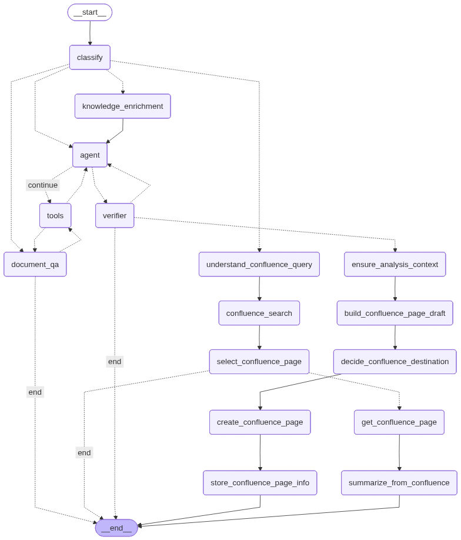

# Data Analysis Agent Prototype

This project is a prototype demonstrating an LLM-powered data analysis agent that can answer analytical questions by generating Python code, executing it, analyzing the results, and responding in natural language.

The goal is to show how an agent can perform end-to-end analysis on internal datasets (such as S3 or Redshift) in the future. For the prototype, the agent operates on multiple local CSV files including COVID-19 patient counts for Japanese prefectures and patient data.

---

## What This Prototype Demonstrates

The agent can:

1. **Answer terminology and document questions**
   - Look up definitions from Excel dictionaries and PDF manuals
   - Search knowledge base using hybrid search (embeddings + TF-IDF)
   - Answer pure document/terminology questions without data analysis
   - Example: "What does GP mean?" or "開発シナジー効果とは？"

2. **Interpret natural-language analytical questions**  
   Example: "How does the number of patients vary from January to July 2025 in Tokyo?"

3. **Enrich data analysis with domain knowledge**
   - Automatically identify domain-specific terms in queries
   - Look up term definitions and map them to dataset columns
   - Use knowledge context to write more accurate analysis code
   - Example: Understands "GP" maps to `channel_type == "GP"` in datasets

4. Plan the required analytical steps (filtering, grouping, aggregating, plotting)

5. Generate executable Python code using pandas and matplotlib

6. Execute the generated code through a controlled tool interface

7. Capture results  
   - dataframe preview  
   - stdout  
   - generated plot (PNG)

8. Understand and summarize the results in natural language, explaining domain terms when relevant

This provides a clear vertical slice of an "LLM analyst" workflow with integrated knowledge management and is designed to be extensible to enterprise data.

---

## Architecture Overview

High-Level Components:

- **LangGraph Server** (`src/langgraph_server/`)  
  - LangGraph agent that interprets queries  
  - writes Python code  
  - retries on errors  
  - summarizes results  
  - loads tools from MCP server via `langchain-mcp-adapters`
  - Includes query classification to route between document QA and data analysis
  - Supports knowledge enrichment for domain-specific terms

- **MCP Server** (`src/mcp_server/`)  
  - FastMCP server exposing data analysis tools
  - Dataset Registry (`datasets_registry.py`): Centralized registry of available datasets with metadata
  - Dataset Store (`dataset_store.py`): Abstraction layer for loading datasets from various storage backends
    - Supports `local_csv`: Local CSV files
    - Supports `s3_csv`: CSV files stored on S3 (using s3fs or boto3)
  - Execution Tool (`run_analysis` in `analysis_tools.py`)  
    - loads one or more datasets into dataframes via DatasetStore
    - executes generated Python code safely  
    - returns previews and plots  
    - supports multi-dataset analysis
    - includes plot validation to detect empty/invalid plots
    - supports advanced libraries: sklearn, statsmodels, torch, Prophet, pmdarima, arch
  - Dataset Tools:
    - `list_datasets`: Lists all available datasets with their IDs, descriptions, code aliases, and storage locations
    - `get_dataset_schema(dataset_id)`: Returns column names, datatypes, sample rows, and row count for a specific dataset
  - Knowledge Layer:
    - Knowledge Registry (`knowledge_registry.py`): Centralized registry of available knowledge documents (Excel dictionaries and PDF manuals)
    - Document Store (`document_store.py`): Loads and parses Excel dictionaries and PDF manuals
      - Excel dictionaries: Parses term definitions with flexible column mapping
      - PDF manuals: Extracts text and chunks documents for RAG-style search
    - Knowledge Index (`knowledge_index.py`): In-memory vector search using embeddings and TF-IDF
      - Auto-detects document language (Japanese/English)
      - Uses multilingual embeddings for Japanese documents
      - Hybrid search combining embeddings, TF-IDF, and exact matching
    - Knowledge Tools:
      - `list_documents`: Lists available knowledge documents with metadata
      - `get_document_metadata(doc_id)`: Gets metadata for a specific document
      - `get_term_definition(term)`: Gets definition of a specific term (exact match + similarity search)
      - `search_knowledge(query, scopes, top_k)`: Searches the knowledge base using hybrid search
  - Utilities (`utils.py`): Shared utility functions including automatic datetime column detection and conversion  

The architecture follows a separation of concerns pattern where:
- MCP tools are defined in `mcp_server/` and exposed via FastMCP
- LangGraph agent flow is defined in `langgraph_server/` and consumes MCP tools

### Agent Workflow

The agent workflow includes query classification and routing:



The workflow routes queries through:
1. **Classification**: Determines if query is DOCUMENT_QA, DATA_ANALYSIS, or BOTH
2. **Document QA Path**: For pure terminology questions, uses knowledge tools to answer
3. **Knowledge Enrichment**: For queries needing both knowledge and analysis, enriches with domain term definitions
4. **Data Analysis Path**: For data analysis queries, proceeds directly to code generation and execution

---

## Repository Structure
```
project-root/
│
├── data/
│ ├── newly_confirmed_cases_daily.csv
│ ├── jpm_patient_data.csv
│ ├── jamdas_patient_data.csv
│ ├── mr_activity_data.csv
│ ├── chugai_pharama_r_and_d_terms.xlsx # Knowledge dictionary (Excel)
│ ├── medical_safety_term.pdf # Knowledge manual (PDF)
│ ├── medical_terms.pdf # Knowledge manual (PDF)
│ └── kaggle_covid/ # Additional COVID-19 datasets (optional)
│
├── img/ # Generated plot images are saved here
│
├── src/
│ ├── langgraph_server/
│ │ ├── graph.py # LangGraph agent definition
│ │ ├── prompts.py # Agent prompts and reasoning steps
│ │ ├── mcp_tool_loader.py # Loads tools from MCP server
│ │ ├── settings.py # LangGraph server settings
│ │ ├── __main__.py # Entry point for CLI mode
│ │ └── generate_diagram.py # Script to generate workflow diagram
│ │
│ ├── mcp_server/
│ │ ├── server.py # FastMCP server entry point
│ │ ├── analysis_tools.py # MCP tools (list_datasets, get_dataset_schema, run_analysis)
│ │ ├── datasets_registry.py # Dataset registry with metadata
│ │ ├── dataset_store.py # Abstraction layer for loading datasets (local_csv, s3_csv)
│ │ ├── knowledge_registry.py # Knowledge document registry with metadata
│ │ ├── document_store.py # Loads and parses Excel dictionaries and PDF manuals
│ │ ├── knowledge_index.py # In-memory vector search (embeddings + TF-IDF)
│ │ ├── knowledge_tools.py # MCP tools (list_documents, get_term_definition, search_knowledge)
│ │ ├── schema.py # Pydantic schemas for tool inputs/outputs
│ │ ├── settings.py # MCP server settings
│ │ ├── utils.py # Shared utility functions (datetime conversion, etc.)
│ │ └── __main__.py # Entry point for running the MCP server
│ │
│ ├── app/
│ │ └── ui.py # Streamlit UI
│
└── README.md
```

---

## Tools

### `list_datasets()`

Returns a list of all available datasets with:
- Dataset IDs
- Descriptions
- Code aliases (variable names for use in code)
- Storage kind (`local_csv` or `s3_csv`)
- Location hint (file path for local, S3 URI for S3)

Use this to discover which datasets are available for analysis.

---

### `get_dataset_schema(dataset_id: str)`

Returns schema information for a specific dataset:
- Column names  
- Inferred dtypes  
- First 5 rows (JSON)
- Row count
- Dataset description

Helps the agent avoid hallucinating nonexistent columns or datatypes.

**Example**: `get_dataset_schema("covid_new_cases_daily")` or `get_dataset_schema("jpm_patient_data")`

---

### `run_analysis(code: str, dataset_ids: list[str], primary_dataset_id: str | None = None)`

Executes generated Python code in a controlled environment with one or more datasets.

**Parameters:**
- `code`: Python code string to execute
- `dataset_ids`: List of dataset IDs to load (e.g., `["covid_new_cases_daily"]` or `["jpm_patient_data", "covid_new_cases_daily"]`)
- `primary_dataset_id`: Optional primary dataset ID (if provided, this dataset is available as `df`)

**Dataset Access in Code:**
- Primary dataset: If `primary_dataset_id` is specified, available as `df`
- Single dataset: If only one dataset is loaded, automatically available as `df`
- All datasets: Access via `dfs[dataset_id]` dictionary
- Code aliases: Each dataset has a code_name (e.g., `df_covid_daily`, `df_jpm_patients`)

**Execution rules:**
- Allowed libraries: pandas (pd), numpy (np), matplotlib.pyplot (plt), sklearn, statsmodels, torch, Prophet, pmdarima, arch
  - sklearn modules: linear_model, metrics, model_selection, preprocessing
  - statsmodels: Comprehensive statistical modeling (OLS, ARIMA, SARIMAX, VAR, etc.)
  - PyTorch: Deep learning and tensor operations
  - Time series: Prophet (Facebook Prophet), pmdarima (Auto ARIMA), arch (ARCH/GARCH)
- Date columns are automatically converted to datetime
- Plot validation: Automatically validates plots to detect empty/invalid plots
- Captures:
  - stdout  
  - error  
  - preview of `result_df` if defined  
  - saved plot with timestamped filename (e.g., `plot_20251115_212901.png`) if created
  - plot validation status and messages

**Example for single dataset:**
```python
run_analysis(
    code="result_df = df.head(10)",
    dataset_ids=["covid_new_cases_daily"],
    primary_dataset_id="covid_new_cases_daily"
)
```

**Example for multiple datasets:**
```python
run_analysis(
    code="merged = df_jpm_patients.merge(df_covid_daily, on='date', how='left'); result_df = merged.head(10)",
    dataset_ids=["jpm_patient_data", "covid_new_cases_daily"],
    primary_dataset_id="jpm_patient_data"
)
```

---

## Agent Behavior

The agent uses intelligent query classification and routing:

### Query Classification

Every query is first classified into one of three categories:
- **DOCUMENT_QA**: Pure terminology/definition questions (e.g., "What does GP mean?")
- **DATA_ANALYSIS**: Data analysis questions with no ambiguous domain terms (e.g., "Show me COVID cases in Tokyo")
- **BOTH**: Questions needing both knowledge lookup and data analysis (e.g., "Compare GP vs HP patient counts")

### Workflow Paths

**Document QA Path:**
1. Query classified as DOCUMENT_QA
2. Agent uses knowledge tools (`get_term_definition`, `search_knowledge`)
3. Returns answer based on knowledge base
4. No data analysis performed

**Data Analysis Path:**
1. Query classified as DATA_ANALYSIS
2. Agent proceeds directly to:
   - Identify datasets needed
   - Plan analytical steps
   - Generate Python code
   - Execute code via `run_analysis`
   - Validate results
   - Summarize findings

**Hybrid Path (BOTH):**
1. Query classified as BOTH
2. Knowledge enrichment step:
   - Identifies domain-specific terms
   - Looks up term definitions
   - Builds knowledge context mapping terms to dataset columns
3. Agent uses knowledge context to:
   - Map domain terms to columns (e.g., "GP" → `channel_type == "GP"`)
   - Generate more accurate analysis code
   - Explain terms in natural language response
4. Proceeds with data analysis as above

### Error Handling

If execution errors occur:
- The agent analyzes the traceback
- Regenerates corrected code
- Retries once

---

## Knowledge Tools

### `list_documents()`

Returns a list of all available knowledge documents (Excel dictionaries and PDF manuals) with:
- Document IDs
- Titles
- Document kind (`excel_dictionary` or `pdf_manual`)
- Source paths
- Descriptions
- Tags

Use this to discover which knowledge documents are available.

---

### `get_document_metadata(doc_id: str)`

Returns metadata for a specific knowledge document.

**Example**: `get_document_metadata("chugai_pharma_r_d_terms")`

---

### `get_term_definition(term: str)`

Gets the definition of a specific term from the knowledge base.

**Behavior:**
- First tries exact match (case-insensitive)
- Checks synonyms if no exact match
- Falls back to similarity search if needed
- Returns `TermEntry` object with definition, synonyms, related columns, etc.

**Example**: `get_term_definition("GP")` or `get_term_definition("開発シナジー効果")`

---

### `search_knowledge(query: str, scopes: Optional[List[str]] = None, top_k: int = 5)`

Searches the knowledge base for relevant information using hybrid search.

**Parameters:**
- `query`: Search query string
- `scopes`: List of scopes to search - `["terms"]` for term definitions only, `["docs"]` for document chunks only, or `["terms", "docs"]` for both (default: both)
- `top_k`: Maximum number of results to return (default: 5)

**Search Methods:**
- **Embedding-based search**: Uses sentence-transformers (multilingual for Japanese)
- **TF-IDF search**: Character-level for Japanese, word-level for English
- **Exact match boosting**: Prioritizes exact phrase matches
- **Hybrid scoring**: Combines multiple signals for better relevance

**Returns:**
- List of `KnowledgeHit` objects with:
  - `kind`: "term" or "chunk"
  - `score`: Similarity score
  - `term_entry`: TermEntry if kind is "term"
  - `chunk`: DocChunk if kind is "chunk" (includes page numbers and section headings)

**Example**: `search_knowledge("pharmaceutical R&D terms", scopes=["terms"], top_k=3)`

---

## Example Queries

You can ask:

- How does the number of patients vary from January to July 2022 in Tokyo?
- Generate and compare the line plots of the number of patients from January to August 2022 in Tokyo, Chiba, Saitama, Kanagawa.
- What characteristics does the patient count data have overall?
- Can you model the Tokyo's covid case and tell me the model clearly?
- Can you compare the each product's number of patients over the time for GP only?
- Can you generate the line plots of the number of the patients for each product only for those at risk over the time?
- Can you create a regression model where we predict the number of patient for LAGEVRIO by the MR activities? Tell me the fitted model and MAPE.
- Generate the line plots of the number of those who are recovered from COVID over the time for South Korea, Canada, France, and US.
- 患者経験調査とは何？
- What does Hp mean?
- 開発シナジー効果とは？
---


## Available Datasets

The system currently supports the following datasets:

1. **jpm_patient_data**: Patient data by product (LAGEVRIO, PAXLOVID, XOCOVA) with HP/GP breakdown
2. **jamdas_patient_data**: Patient data with at-risk and DDI prescription information (GP only)
3. **covid_new_cases_daily**: COVID-19 newly confirmed cases daily data for Japanese prefectures (local CSV)
4. **mr_activity_data**: MR activity data by prefecture, month, and HP/GP type (detailing visits, emails, seminars) for all 47 prefectures from 2023-04 to 2025-09
5. **covid_full_grouped**: Global COVID-19 data grouped by country/region and date (S3-based)

Datasets can be stored locally (`local_csv`) or on S3 (`s3_csv`). The DatasetStore abstraction handles loading from both sources transparently.

---

## Available Knowledge Documents

The system currently supports the following knowledge documents:

1. **chugai_pharma_r_d_terms** (Excel Dictionary)
   - Chugai Pharmaceutical R&D terminology dictionary
   - Contains terms and explanations in Japanese (e.g., アンメットメディカルニーズ, 開発シナジー効果, 開発パイプライン)
   - Format: Excel with "Term" and "Explanation" columns

2. **medical_safety_terms** (PDF Manual)
   - Medical safety terminology and definitions
   - Extracted and chunked for RAG-style search

3. **medical_terms** (PDF Manual)
   - General medical terminology reference guide
   - Extracted and chunked for RAG-style search

Knowledge documents are automatically indexed on MCP server startup using:
- **Multilingual embeddings** for Japanese documents (paraphrase-multilingual-MiniLM-L12-v2)
- **TF-IDF** with language-appropriate settings (character-level for Japanese, word-level for English)
- **Hybrid search** combining embeddings, TF-IDF, and exact matching for optimal results

---

## Technical Details

### Knowledge Index Architecture

The knowledge index uses an **in-memory vector search** approach:

- **No database required**: All embeddings and vectors stored in memory as NumPy arrays
- **Fast search**: Vectorized operations using NumPy for efficient similarity computation
- **Hybrid search**: Combines multiple search methods:
  - Embedding-based similarity (60% weight)
  - TF-IDF similarity (40% weight)
  - Exact match boosting (30% additional weight)
- **Language-aware**: Auto-detects document language and uses appropriate models
  - Japanese: Multilingual embeddings + character-level TF-IDF
  - English: English embeddings + word-level TF-IDF
- **Memory efficient**: Suitable for small-to-medium document collections (thousands of documents)

### Document Processing

- **Excel dictionaries**: Flexible column mapping supports various formats (Term/Definition, Term/Explanation, etc.)
- **PDF manuals**: Intelligent chunking with:
  - Target chunk size: 2000 characters
  - Minimum chunk size: 300 characters
  - Overlap: 300 characters for context preservation
  - Section heading detection and weighting
  - Automatic merging of small chunks

---

## Future Extensions

- Connecting to additional data sources (Redshift, BigQuery, etc.) using MCP tools
- Enhanced multi-dataset discovery and retrieval
- Multi-agent planning (planner / code writer / verifier)
- Schema retrieval via RAG
- Query decomposition for complex analytics
- Notebook-style report generation
- Additional statistical and machine learning libraries
- Persistent vector database (pgvector) for larger document collections
- Additional document formats (Word, Markdown, etc.)

This prototype is intentionally simple but complete, demonstrating the viability of LLM-driven data analysis workflows with integrated knowledge management.

---

## Setup and Running

### 1. Install Dependencies

```bash
# Using uv (recommended)
uv sync

# Or using pip
pip install -e .
```

### 2. Set Environment Variables

Create a `.env` file with:
```bash
OPENAI_API_KEY=your_openai_api_key
DATA_ANALYSIS_MCP_SERVER_URL=http://localhost:8082/mcp  # Default MCP server URL (must include /mcp path)
LANGGRAPH_SERVER_URL=http://localhost:2024  # Default LangGraph Server URL (used by Streamlit)
LANGGRAPH_ASSISTANT_ID=<your-assistant-uuid>  # Assistant ID (UUID) for LangGraph Server - find it in LangGraph Studio UI

# Optional: For S3-based datasets (e.g., covid_full_grouped)
AWS_DEFAULT_REGION=us-east-1
AWS_ACCESS_KEY_ID=your_aws_access_key
AWS_SECRET_ACCESS_KEY=your_aws_secret_key
AWS_S3_BUCKET=your_bucket_name
```

**Important**: When you run `langgraph dev`, it will automatically create an assistant from your graph. The `assistant_id` is typically a UUID (not the graph name). You can find it by:
1. Opening the LangGraph Studio UI (URL shown when you run `langgraph dev`)
2. Looking at the assistant details in the Studio UI
3. Or checking the server logs when `langgraph dev` starts

Once you have the UUID, set it as `LANGGRAPH_ASSISTANT_ID` in your `.env` file.

### 3. Start the Servers

The system consists of three separate servers that need to be running:

**Terminal 1 - MCP Server:**
```bash
python -m src.mcp_server
```
The MCP server will start on port 8082 by default (configurable via `PORT` environment variable).

**Terminal 2 - LangGraph Server:**
```bash
langgraph dev --config src/langgraph_server/langgraph.json
```
The LangGraph Server will start on port 2024 by default (configurable via `--port` flag).

Alternatively, you can run from the `langgraph_server` directory:
```bash
cd src/langgraph_server
langgraph dev
```
This provides the official LangGraph Server API with endpoints like `/threads`, `/runs`, `/messages`.

**Terminal 3 - Streamlit UI:**
```bash
streamlit run src/app/ui.py
```
The Streamlit app will open in your browser automatically (usually at `http://localhost:8501`).

### 4. Alternative: CLI Mode

You can also run the agent in CLI mode (without the LangGraph Server):

**Interactive mode:**
```bash
python -m src.langgraph_server
```

**Single query:**
```bash
python -m src.langgraph_server "How does the number of patients vary from January to July 2025 in Tokyo?"
```

### 5. Generate Workflow Diagram (Optional)

To generate a visual diagram of the agent workflow:

```bash
python -m src.langgraph_server.generate_diagram
```

Options:
- `--output` or `-o`: Specify output file path (default: `agent_workflow.png`)
- `--format` or `-f`: Specify format - `png`, `svg`, or `mermaid` (default: `png`)

Examples:
```bash
# Generate PNG diagram
python -m src.langgraph_server.generate_diagram

# Generate SVG diagram
python -m src.langgraph_server.generate_diagram --format svg

# Custom output path
python -m src.langgraph_server.generate_diagram --output my_workflow.png
```

---

## Architecture Notes

The project follows a clean separation of concerns with three independent servers:

1. **MCP Server** (`src/mcp_server/`): 
   - Defines and exposes tools via FastMCP
   - Runs on port 8082 (default)
   - Tools are independent and can be reused by other agents or services
   - Supports multiple storage backends (local files, S3) via DatasetStore abstraction

2. **LangGraph Server** (`src/langgraph_server/`): 
   - Defines the agent workflow and consumes MCP tools via HTTP
   - Served via `langgraph dev` command (official LangGraph Server runtime)
   - Runs on port 2024 (default) with endpoints: `/threads`, `/runs`, `/messages`
   - Provides built-in persistence, event streaming, and checkpointing
   - Can also run in CLI mode: `python -m src.langgraph_server`
   - The agent doesn't need to know about tool implementation details, only their interfaces

3. **Streamlit UI** (`src/app/ui.py`):
   - Web-based user interface
   - Connects to LangGraph server via HTTP API
   - Runs on port 8501 (default, Streamlit default)
   - Completely decoupled from the agent implementation

This architecture provides:
- **Separation of concerns**: Each server has a single responsibility
- **Scalability**: Each component can be scaled independently
- **Testability**: Components can be tested in isolation
- **Flexibility**: Easy to swap UI implementations or add new clients
- **Reusability**: Tools and agent can be used by other services
