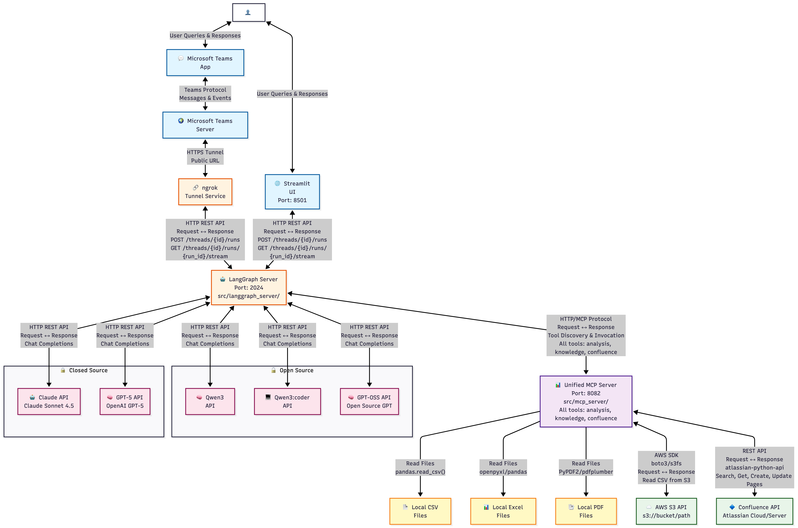
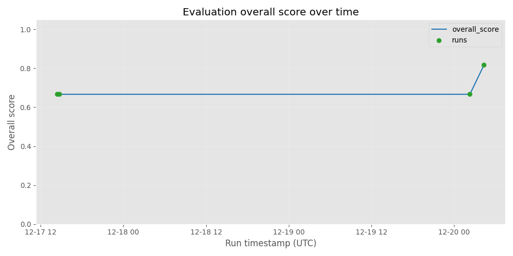

# Data Analysis Agent

An LLM-powered data analysis agent that answers analytical questions by generating Python code, executing it, and responding in natural language. The agent integrates with knowledge bases, Confluence, and supports multiple datasets.

---

## Features

- **Query Classification**: Automatically routes queries to document QA, data analysis, or Confluence operations
- **Data Analysis**: Generates and executes Python code for data analysis with pandas, matplotlib, sklearn, statsmodels, and more
- **Knowledge Integration**: Looks up domain-specific terms and maps them to dataset columns
- **Confluence Integration**: Export analysis results to Confluence or read/summarize existing pages
- **Multi-Dataset Support**: Works with multiple datasets stored locally or on S3
- **Error Recovery**: Automatically retries code generation on errors

---

## Architecture

The system consists of two main components:

1. **LangGraph Server** (`src/langgraph_server/`): Agent workflow with nodes for classification, reasoning, code generation, and verification
2. **Unified MCP Server** (`src/mcp_server/`): Exposes all tools via FastMCP:
   - **Analysis Tools**: Data analysis, dataset operations (run_analysis, list_datasets, get_dataset_schema)
   - **Knowledge Tools**: Knowledge base search, term definitions (search_knowledge, get_term_definition, list_documents)
   - **Confluence Tools**: Confluence integration (search_pages, get_page, create_page, update_page)

### System Architecture Diagram



### Agent Workflow


```
User Query
    ↓
Classification (DOCUMENT_QA / DATA_ANALYSIS / BOTH)
    ↓
┌─────────────────┬──────────────────┬─────────────────┐
│ Document QA     │ Knowledge        │ Data Analysis   │
│                 │ Enrichment       │                 │
│                 │                  │                 │
│ Uses knowledge  │ Enriches query   │ Identifies      │
│ tools to answer │ with domain      │ datasets        │
│ terminology     │ term definitions │                 │
│ questions       │                  │ Gets schemas    │
│                 │                  │                 │
│                 │                  │ Generates code  │
│                 │                  │ Executes code   │
│                 │                  │ Validates       │
│                 │                  │ Summarizes      │
└─────────────────┴──────────────────┴─────────────────┘
    ↓
Confluence Export (if requested)
```

---

## Repository Structure

```
data-analysis-agent/
├── data/                          # Datasets and knowledge documents
│   ├── *.csv                      # Dataset files
│   ├── *.xlsx                     # Knowledge dictionaries
│   └── *.pdf                      # Knowledge manuals
│
├── src/
│   ├── langgraph_server/          # LangGraph agent
│   │   ├── graph.py               # Graph definition (nodes & edges)
│   │   ├── nodes/                 # Node implementations
│   │   │   ├── agent.py           # Main reasoning node
│   │   │   ├── classify_query.py  # Query classification
│   │   │   ├── code_generation.py # Code generation
│   │   │   ├── document_qa.py     # Document Q&A
│   │   │   ├── knowledge_enrichment.py
│   │   │   ├── verifier.py        # Response verification
│   │   │   ├── tools.py            # Tool execution
│   │   │   ├── confluence_export.py
│   │   │   ├── confluence_read.py
│   │   │   └── utils.py
│   │   ├── prompts/               # Prompts organized by role
│   │   │   ├── agent.py           # Main agent prompts
│   │   │   ├── code_generation.py
│   │   │   ├── document_qa.py
│   │   │   ├── knowledge_enrichment.py
│   │   │   ├── verifier.py
│   │   │   ├── classification/    # Classification prompts
│   │   │   │   ├── query.py
│   │   │   │   ├── doc_action.py
│   │   │   │   └── combined.py
│   │   │   └── confluence/        # Confluence prompts
│   │   │       └── query_understanding.py
│   │   ├── generate_diagram.py    # Workflow diagram generator
│   │   ├── mcp_tool_loader.py     # MCP tool loading
│   │   ├── llm_utils.py           # LLM initialization
│   │   └── settings.py            # Configuration
│   │
│   ├── mcp_server/                # Unified MCP server (all tools)
│   │   ├── server.py              # Main FastMCP server (combines all domains)
│   │   ├── analysis_tools.py      # Analysis domain tools
│   │   ├── knowledge_tools.py    # Knowledge domain tools
│   │   ├── servers/               # Domain-specific tool modules
│   │   │   ├── confluence/        # Confluence domain tools
│   │   │   │   └── tools.py
│   │   │   └── analysis/          # Analysis domain module (future)
│   │   ├── datasets_registry.py   # Dataset metadata
│   │   ├── dataset_store.py      # Dataset loading (local/S3)
│   │   ├── knowledge_registry.py  # Knowledge document metadata
│   │   ├── document_store.py      # Document parsing
│   │   ├── knowledge_index.py     # Vector search
│   │   ├── schema.py              # Pydantic schemas
│   │   └── settings.py            # Server configuration
│   │
│   ├── app/
│   │   └── ui.py                  # Streamlit UI
│   │
│   └── teams_bot/                 # Microsoft Teams bot
│       ├── __init__.py
│       ├── config.py              # Bot configuration settings
│       ├── langgraph_client.py    # LangGraph API client wrapper
│       ├── bot.py                 # Bot Framework bot handler
│       └── server.py              # HTTP server with Bot Framework adapter
│
└── README.md
```

---

## Quick Start

### 1. Install Dependencies

```bash
uv sync
# or
pip install -e .
```

### 2. Configure Environment

Create a `.env` file:

```bash
# LLM Configuration (required)
CHAT_NODE__llm_model_provider=openai
CHAT_NODE__llm_model_name=gpt-4o
CHAT_NODE__temperature=0.1
CHAT_NODE__api_key=your_api_key

# Unified MCP Server (includes all tools: analysis, knowledge, confluence)
MCP_SERVER_URL=http://localhost:8082/mcp

# LangGraph Server
LANGGRAPH_SERVER_URL=http://localhost:2024
LANGGRAPH_ASSISTANT_ID=<your-assistant-uuid>

# Microsoft Teams Bot (optional for local development, required for production)
MICROSOFT_APP_ID=<your-azure-app-id>  # Leave empty for local dev with emulator
MICROSOFT_APP_PASSWORD=<your-azure-app-password>  # Leave empty for local dev with emulator
TEAMS_BOT_PORT=3978  # Optional, defaults to 3978

# Optional: Confluence credentials (enables Confluence tools in unified server)
CONFLUENCE_URL=https://yourcompany.atlassian.net
CONFLUENCE_USERNAME=your.email@company.com
CONFLUENCE_API_TOKEN=your_api_token_here
CONFLUENCE_SPACE_KEY_ANALYTICS=ANALYTICS
```

### 3. Start Servers

**Terminal 1 - Unified MCP Server:**
```bash
python -m src.mcp_server
```
This starts a single unified server that includes:
- Analysis tools (list_datasets, get_dataset_schema, run_analysis)
- Knowledge tools (list_documents, get_term_definition, search_knowledge)
- Confluence tools (if credentials are configured)

**Terminal 2 - LangGraph Server:**
```bash
langgraph dev --config src/langgraph_server/langgraph.json
```

**Terminal 3 - Streamlit UI:**
```bash
streamlit run src/app/ui.py
```

**Terminal 3 (Alternative) - Microsoft Teams Bot:**
```bash
python -m src.teams_bot.server
```
This starts the Teams bot HTTP server on port 3978 (configurable via `TEAMS_BOT_PORT`).

### 4. Alternative: CLI Mode

```bash
# Interactive
python -m src.langgraph_server

# Single query
python -m src.langgraph_server "Show me COVID cases in Tokyo"
```

---

## Evaluation & Metrics

### Continuous Evaluation

- **CI workflow**: Every push and pull request to `main` runs the `Agent Evaluation` GitHub Actions workflow, which:
  - Generates a per-run report in `eval_report.json`
  - Appends a summary of the run into `eval_history.json`
  - Creates a plot of overall score over time at `img/eval_history.png`

- **On PRs**:
  - Go to the PR → **Checks** → **Agent Evaluation** → **Artifacts** → download `eval-artifacts`
  - Inside the archive you'll find:
    - `eval_report.json`: full details of the latest run
    - `eval_history.json`: accumulated history across runs
    - `img/eval_history.png`: plot of overall evaluation score over time

- **On `main`**:
  - On every push to `main`, the workflow commits the latest:
    - `eval_report.json`
    - `eval_history.json`
    - `img/eval_history.png`
  - You can open the current evaluation trend directly in the repo:

    

### Run Evaluation Locally

- **Single run (writes `eval_report.json`)**:

```bash
uv run python -m eval.run_eval --cases eval/cases --out eval_report.json --fail-under 0.5
```

- **Append to history and regenerate plot**:

```bash
uv run python -m eval.update_history --report eval_report.json --history eval_history.json
uv run python -m eval.plot_eval_history --history eval_history.json --out img/eval_history.png
```

---

## Available Tools

### Data Analysis Tools

- **`list_datasets()`**: List all available datasets
- **`get_dataset_schema(dataset_id)`**: Get schema information for a dataset
- **`run_analysis(code, dataset_ids, primary_dataset_id=None)`**: Execute Python code with datasets

### Knowledge Tools

- **`list_documents()`**: List available knowledge documents
- **`get_term_definition(term)`**: Get definition of a term
- **`search_knowledge(query, scopes, top_k)`**: Search knowledge base

### Confluence Tools

- **`confluence_search_pages(query)`**: Search Confluence pages
- **`confluence_get_page(page_id)`**: Get page content
- **`confluence_create_page(space_key, title, body)`**: Create a page

---

## Example Queries

- "Show me COVID cases in Tokyo from January to July 2025"
- "What does GP mean?"
- "Compare GP vs HP patient counts"
- "Create a Confluence report from this analysis"
- "What were the main takeaways from the last GP vs HP analysis in Confluence?"

- How does the number of patients vary from January to July 2022 in Tokyo?
- 2022年1月から2022年12月までの東京のコロナウイルス感染者数を図にして、要約して
- Generate and compare the line plots of the number of patients from January to August 2022 in Tokyo, Chiba, Saitama, Kanagawa.
- What characteristics does the patient count data have overall?
- Can you model the Tokyo's covid case and tell me the model clearly?
- Can you compare the each product's number of patients over the time for GP only?
- HPのみに絞った上で、ラゲブリオ、パケロビッド、ゾコーバのそれぞれのコロナウイルス治療患者数を2022年1月から2024年12月までで図にして
- Can you generate the line plots of the number of the patients for each product only for those at risk over the time?
- Can you create a regression model where we predict the number of patient for LAGEVRIO by the MR activities? Tell me the fitted model and MAPE.
- MRの活動からラゲブリオの患者人数を予測する回帰モデルを作成して、予測精度についてまとめて、回帰モデルをわかりやすく説明して
- Generate the line plots of the number of those who are recovered from COVID over the time for South Korea, Canada, France, and US.
- 韓国、カナダ、フランス、アメリカに関して、コロナウイルス治癒患者数を時系列でプロットして
- 世界規模の動向を知るために、韓国、カナダ、フランス、アメリカに関して、コロナウイルス治癒患者数を時系列でプロットして
- 患者経験調査とは何？
- What does Hp mean?
- 開発シナジー効果とは？
- What kind of confluence pages can I see?
- どのようなConfluenceのページがある？
- Summarize the result and create a confluence page about your analysis.
- Create a Confluence report from this analysis.
- コロナウイルスに関する今までの分析をまとめて、Confluenceのページに投稿して
---

## Available Datasets

- `jpm_patient_data`: Patient data by product with HP/GP breakdown
- `jamdas_patient_data`: Patient data with at-risk and DDI information
- `covid_new_cases_daily`: COVID-19 cases by Japanese prefecture
- `mr_activity_data`: MR activity data by prefecture and month

---

## Code Generation

The code generation node generates Python code that:
- Uses pandas, numpy, matplotlib, sklearn, statsmodels, torch, Prophet, pmdarima, arch
- Automatically converts date columns to datetime
- Assigns results to `result_df` variable
- Creates plots using `plt.savefig(plot_filename)`
- Validates plots to detect empty/invalid results

---

## Confluence Integration

The agent can:
1. **Export to Confluence**: Create structured reports from analysis results
2. **Read from Confluence**: Search and summarize existing pages

---

## Generate Workflow Diagram

```bash
python -m src.langgraph_server.generate_diagram
# Options: --output, --format (png/svg/mermaid)
```

---

## Microsoft Teams Bot Integration

The agent can be accessed via Microsoft Teams as a bot, allowing users to interact with the data analysis agent directly from Teams.

### Architecture

```
Teams User → Microsoft Teams → Azure Bot Service → Teams Bot HTTP Server → LangGraph Server + MCP
```

The Teams bot is implemented using the Bot Framework SDK v4 for Python and provides a natural language interface to the same agent backend used by the Streamlit UI.

### Setup

1. **Create Azure Bot Resource**:
   - Create an Azure Bot resource in the Azure Portal
   - Note the App ID and generate a client secret (App Password)
   - Configure the messaging endpoint to point to your bot server (e.g., `https://your-domain.com/api/messages`)

2. **Configure Environment Variables**:
   ```bash
   MICROSOFT_APP_ID=<your-azure-app-id>
   MICROSOFT_APP_PASSWORD=<your-azure-app-password>
   TEAMS_BOT_PORT=3978  # Optional, defaults to 3978
   ```

3. **Start the Bot Server**:
   ```bash
   # Make sure MCP server and LangGraph server are running first
   python -m src.teams_bot.server
   ```

4. **Local Testing with Bot Framework Emulator**:
   - Download and install the [Bot Framework Emulator](https://github.com/Microsoft/BotFramework-Emulator/releases)
   - For local development, you can leave `MICROSOFT_APP_ID` and `MICROSOFT_APP_PASSWORD` empty in your `.env` file (authentication will be bypassed)
   - Configure the emulator with:
     - Endpoint: `http://localhost:3978/api/messages`
     - App ID: Leave empty or use any value (ignored when bot's app_id is empty)
     - App Password: Leave empty or use any value (ignored when bot's app_password is empty)
   - **Important**: 
     - Use the **Bot Framework Emulator** (not Web Chat) for local testing without credentials
     - The emulator uses `channelId="emulator"` which works without Azure credentials
     - Bot Framework Web Chat (`channelId="webchat"`) requires valid Azure credentials
     - For production deployment, you must set valid `MICROSOFT_APP_ID` and `MICROSOFT_APP_PASSWORD`

### Features

- **Natural Language Interface**: Users can ask analytical questions in Teams
- **Conversation State**: Each Teams conversation maintains its own thread state in LangGraph
- **Error Handling**: Friendly error messages if something goes wrong
- **Welcome Message**: Automatic greeting when the bot is added to a conversation

### Usage

Once the bot is deployed and added to a Teams channel or chat:

1. Users can send messages directly to the bot
2. The bot processes queries through the LangGraph agent
3. Responses are sent back to the Teams conversation
4. Each conversation maintains its own context/thread

Example interactions:
- "Show me COVID cases in Tokyo from January to July 2022"
- "What does GP mean?"
- "Compare GP vs HP patient counts"

---

## Architecture Notes

- **Unified MCP Server**: All tools (analysis, knowledge, confluence) are exposed through a single MCP server endpoint, simplifying deployment and configuration
- **Domain-Driven Design**: Tools are organized by domain (analysis, knowledge, confluence) under `src/mcp_server/servers/`
- **Separation of Concerns**: MCP tools, LangGraph agent, and UI are independent
- **Scalability**: Each component can be scaled independently
- **Extensibility**: Easy to add new tool domains or tools within existing domains
- **Clean Structure**: Prompts organized by role, nodes by function, tools by domain

---