# System Architecture Diagram

This document contains a Mermaid diagram showing the complete architecture and connections between all components.

```mermaid
graph TB
    %% User Interface Layer
    User[👤 User]
    Streamlit[🌐 Streamlit UI<br/>Port: 8501<br/>src/app/ui.py]
    Teams[💬 Microsoft Teams App<br/>Teams Client]
    TeamsServer[🌍 Microsoft Teams Server<br/>Public/Cloud]
    Ngrok[🔗 ngrok<br/>Tunnel Service]
    
    %% Core Agent Layer
    LangGraph[🤖 LangGraph Server<br/>Port: 2024<br/>src/langgraph_server/]
    
    %% Unified MCP Server Layer
    UnifiedMCP[📊 Unified MCP Server<br/>Port: 8082<br/>src/mcp_server/<br/>All tools: analysis, knowledge, confluence]
    
    %% External APIs
    ConfluenceAPI[🔷 Confluence API<br/>Atlassian Cloud/Server]
    AWSS3[☁️ AWS S3 API<br/>s3://bucket/path]
    
    %% Data Sources
    LocalCSV[📄 Local CSV Files<br/>data/*.csv]
    LocalExcel[📊 Local Excel Files<br/>data/*.xlsx]
    LocalPDF[📑 Local PDF Files<br/>data/*.pdf]
    
    %% LLM Services - Open Source
    subgraph OpenSource["🔓 Open Source LLMs"]
        Qwen3[🧠 Qwen3 API<br/>Qwen3 Model]
        Qwen3Coder[💻 Qwen3:coder API<br/>Qwen3 Coder Model]
        GPTOSS[🧠 GPT-OSS API<br/>Open Source GPT]
    end
    
    %% LLM Services - Closed Source
    subgraph ClosedSource["🔒 Closed Source LLMs"]
        Claude[🤖 Claude API<br/>Claude Sonnet 4.5]
        GPT5[🧠 GPT-5 API<br/>OpenAI GPT-5]
    end
    
    %% User interactions
    User <-->|"User Queries & Responses"| Streamlit
    User <-->|"User Queries & Responses"| Teams
    
    %% Teams flow: Teams -> Teams Server -> ngrok -> LangGraph
    Teams <-->|"Teams Protocol<br/>Messages & Events"| TeamsServer
    TeamsServer <-->|"HTTPS Tunnel<br/>Public URL"| Ngrok
    Ngrok <-->|"HTTP REST API<br/>Request ↔ Response<br/>POST /threads/{id}/runs<br/>GET /threads/{id}/runs/{run_id}/stream"| LangGraph
    
    %% UI to LangGraph (bidirectional HTTP REST API)
    Streamlit <-->|"HTTP REST API<br/>Request ↔ Response<br/>POST /threads/{id}/runs<br/>GET /threads/{id}/runs/{run_id}/stream"| LangGraph
    
    %% LangGraph connections (bidirectional MCP protocol)
    LangGraph <-->|"HTTP/MCP Protocol<br/>Request ↔ Response<br/>Tool Discovery & Invocation<br/>All tools: analysis, knowledge, confluence"| UnifiedMCP
    LangGraph <-->|"HTTP REST API<br/>Request ↔ Response<br/>Chat Completions"| Qwen3
    LangGraph <-->|"HTTP REST API<br/>Request ↔ Response<br/>Chat Completions"| Qwen3Coder
    LangGraph <-->|"HTTP REST API<br/>Request ↔ Response<br/>Chat Completions"| GPTOSS
    LangGraph <-->|"HTTP REST API<br/>Request ↔ Response<br/>Chat Completions"| Claude
    LangGraph <-->|"HTTP REST API<br/>Request ↔ Response<br/>Chat Completions"| GPT5
    
    %% Unified MCP Server connections
    UnifiedMCP -->|"Read Files<br/>pandas.read_csv()"| LocalCSV
    UnifiedMCP -->|"Read Files<br/>openpyxl/pandas"| LocalExcel
    UnifiedMCP -->|"Read Files<br/>PyPDF2/pdfplumber"| LocalPDF
    UnifiedMCP <-->|"AWS SDK<br/>boto3/s3fs<br/>Request ↔ Response<br/>Read CSV from S3"| AWSS3
    UnifiedMCP <-->|"REST API<br/>Request ↔ Response<br/>atlassian-python-api<br/>Search, Get, Create, Update Pages"| ConfluenceAPI
    
    %% Styling
    classDef ui fill:#e1f5ff,stroke:#01579b,stroke-width:2px
    classDef agent fill:#fff3e0,stroke:#e65100,stroke-width:2px
    classDef mcp fill:#f3e5f5,stroke:#4a148c,stroke-width:2px
    classDef api fill:#e8f5e9,stroke:#1b5e20,stroke-width:2px
    classDef data fill:#fff9c4,stroke:#f57f17,stroke-width:2px
    classDef llm fill:#fce4ec,stroke:#880e4f,stroke-width:2px
    classDef tunnel fill:#fff3e0,stroke:#e65100,stroke-width:2px
    
    class Streamlit,Teams,TeamsServer ui
    class LangGraph agent
    class UnifiedMCP mcp
    class ConfluenceAPI,AWSS3 api
    class LocalCSV,LocalExcel,LocalPDF data
    class Qwen3,Qwen3Coder,GPTOSS,Claude,GPT5 llm
    class Ngrok tunnel
```

## Component Details

### Streamlit UI (Port 8501)
- **Purpose**: Web-based user interface
- **Connections**: 
  - Connects to LangGraph Server via HTTP REST API
  - Endpoints: `/threads`, `/runs`, `/assistants`
- **Technology**: Streamlit framework

### Microsoft Teams App
- **Purpose**: Enterprise collaboration platform interface (client-side)
- **Connections**: 
  - Connects to Microsoft Teams Server (public/cloud) via Teams Protocol
- **Technology**: Microsoft Teams Client Application
- **Key Features**:
  - Chat-based interaction
  - Enterprise integration
  - Team collaboration support

### Microsoft Teams Server (Public/Cloud)
- **Purpose**: Microsoft's cloud-based Teams infrastructure
- **Connections**: 
  - Receives messages from Teams clients
  - Forwards requests to ngrok tunnel
- **Technology**: Microsoft Teams Cloud Platform
- **Key Features**:
  - Message routing
  - Authentication and authorization
  - Public cloud infrastructure

### ngrok
- **Purpose**: Secure tunnel service for exposing local services to the internet
- **Connections**: 
  - Receives requests from Microsoft Teams Server
  - Forwards to LangGraph Server via HTTPS tunnel
- **Technology**: ngrok tunneling service
- **Key Features**:
  - Public URL generation
  - HTTPS encryption
  - Request forwarding to local LangGraph Server
  - Endpoints: `/threads`, `/runs`, `/assistants`

### LangGraph Server (Port 2024)
- **Purpose**: Main agent orchestrator
- **Connections**:
  - Receives requests from Streamlit UI (direct HTTP)
  - Receives requests from Microsoft Teams App via ngrok tunnel
  - Connects to Unified MCP Server (port 8082) for all tools
  - Calls multiple LLM APIs for inference (open source: Qwen3, Qwen3:coder, GPT-OSS; closed source: Claude Sonnet 4.5, GPT-5)
- **Technology**: LangGraph framework, langchain-mcp-adapters
- **Key Features**:
  - Query classification
  - Tool orchestration
  - State management
  - Error handling and retries
  - Multi-LLM support with model selection/routing
  - Support for both open source and closed source LLMs

### Unified MCP Server (Port 8082)
- **Purpose**: Exposes all tools via MCP (analysis, knowledge, confluence)
- **Connections**:
  - Reads local CSV files from `data/` directory
  - Reads local Excel files from `data/` directory
  - Reads local PDF files from `data/` directory
  - Accesses AWS S3 via boto3/s3fs for remote CSV files
  - Connects to Confluence API (Atlassian Cloud/Server)
- **Tools Exposed**:
  - **Analysis Tools**:
    - `list_datasets`: List available datasets
    - `get_dataset_schema`: Get dataset schema
    - `run_analysis`: Execute Python code
  - **Knowledge Tools**:
    - `list_documents`: List knowledge documents
    - `get_term_definition`: Get term definitions
    - `search_knowledge`: Search knowledge base
  - **Confluence Tools** (if credentials configured):
    - `confluence_search_pages`: Search Confluence pages
    - `confluence_get_page`: Get page content
    - `confluence_create_page`: Create new pages
    - `confluence_update_page`: Update existing pages
- **Technology**: FastMCP, pandas, matplotlib, sklearn, atlassian-python-api, etc.
- **Architecture**: Domain-driven design with tools organized under `src/mcp_server/servers/`

### Data Sources
- **Local CSV Files**: Stored in `data/` directory (e.g., `newly_confirmed_cases_daily.csv`)
- **Local Excel Files**: Stored in `data/` directory (e.g., `chugai_pharama_r_and_d_terms.xlsx`)
- **Local PDF Files**: Stored in `data/` directory (e.g., `medical_safety_term.pdf`)
- **AWS S3**: Remote CSV files accessed via AWS API (e.g., `covid_full_grouped` dataset)

### External APIs
- **Confluence API**: Atlassian's Confluence REST API for page operations
- **AWS S3 API**: Amazon S3 API for reading CSV files from S3 buckets

### LLM Services

#### Open Source LLMs (🔓)
- **Qwen3 API**: Alibaba Cloud's Qwen3 model for general-purpose LLM inference
- **Qwen3:coder API**: Alibaba Cloud's Qwen3:coder model specialized for code generation and analysis
- **GPT-OSS API**: Open source GPT model for LLM inference (query classification, code generation, summarization)
- **Benefits**: 
  - No API costs
  - Full control and customization
  - Privacy and data sovereignty
  - Self-hosted deployment options

#### Closed Source LLMs (🔒)
- **Claude API**: Anthropic's Claude Sonnet 4.5 model for advanced reasoning and analysis
- **GPT-5 API**: OpenAI's GPT-5 model for LLM inference (query classification, code generation, summarization)
- **Benefits**:
  - State-of-the-art performance
  - Managed infrastructure
  - Regular model updates
  - Enterprise support

**Usage**: LangGraph Server can route requests to different models based on task requirements:
- Code tasks → Qwen3:coder or GPT-OSS
- General queries → Qwen3, GPT-5, or Claude
- Advanced reasoning → Claude Sonnet 4.5
- Cost-sensitive tasks → Open source models (Qwen3, Qwen3:coder, GPT-OSS)

## Data Flow Examples

### Data Analysis Flow
1. User submits query via Streamlit UI or Microsoft Teams App
2. **Streamlit path**: UI sends request directly to LangGraph Server
   **Teams path**: Teams → Teams Server (public) → ngrok → LangGraph Server
3. LangGraph Server classifies query and routes to agent
4. Agent selects appropriate LLM (open source: Qwen3, Qwen3:coder, GPT-OSS; closed source: Claude Sonnet 4.5, GPT-5) based on task
5. Agent calls Unified MCP Server analysis tools
6. MCP Server reads data from CSV/Excel/PDF files or AWS S3
7. MCP Server executes analysis code
8. Results flow back through LangGraph Server to the originating UI (Streamlit or Teams via ngrok)

### Confluence Export Flow
1. User requests "Create Confluence report from this analysis" via Streamlit UI or Microsoft Teams App
2. **Streamlit path**: Direct to LangGraph Server
   **Teams path**: Teams → Teams Server → ngrok → LangGraph Server
3. LangGraph Server detects `FROM_ANALYSIS` intent
4. Agent uses appropriate LLM (open source or closed source) to extract analysis context
5. Agent calls Unified MCP Server `confluence_create_page` tool
6. Unified MCP Server calls Confluence API to create page
7. Page URL returned to user via the originating UI (Streamlit or Teams via ngrok)

### Confluence Read Flow
1. User asks "What pages are in Confluence?" via Streamlit UI or Microsoft Teams App
2. **Streamlit path**: Direct to LangGraph Server
   **Teams path**: Teams → Teams Server → ngrok → LangGraph Server
3. LangGraph Server detects `FROM_CONFLUENCE` intent
4. Agent calls Unified MCP Server `confluence_search_pages` tool
5. Unified MCP Server calls Confluence API to search
6. Results processed and displayed to user via the originating UI

## Protocol Details

- **Streamlit ↔ LangGraph**: HTTP REST API (JSON)
- **Microsoft Teams ↔ Teams Server**: Teams Protocol (Messages & Events)
- **Teams Server ↔ ngrok**: HTTPS Tunnel (Public URL)
- **ngrok ↔ LangGraph**: HTTP REST API (JSON) via HTTPS tunnel
- **LangGraph ↔ Unified MCP Server**: HTTP/MCP Protocol (Model Context Protocol)
- **Unified MCP Server ↔ External APIs**: REST APIs (JSON)
- **Unified MCP Server ↔ Local Files**: File system I/O
- **LangGraph ↔ Qwen3** (Open Source): HTTP REST API (Qwen3 Chat Completions)
- **LangGraph ↔ Qwen3:coder** (Open Source): HTTP REST API (Qwen3 Coder Chat Completions)
- **LangGraph ↔ GPT-OSS** (Open Source): HTTP REST API (Open Source GPT Chat Completions)
- **LangGraph ↔ Claude** (Closed Source): HTTP REST API (Anthropic Claude API)
- **LangGraph ↔ GPT-5** (Closed Source): HTTP REST API (OpenAI Chat Completions)
