# System Architecture Diagram

This document contains a Mermaid diagram showing the complete architecture and connections between all components.

```mermaid
graph TB
    %% User Interface Layer
    User[👤 User]
    Streamlit[🌐 Streamlit UI<br/>Port: 8501<br/>src/app/ui.py]
    
    %% Core Agent Layer
    LangGraph[🤖 LangGraph Server<br/>Port: 2024<br/>src/langgraph_server/]
    
    %% MCP Server Layer
    MCPDataAnalysis[📊 Data Analysis MCP Server<br/>Port: 8082<br/>src/mcp_server/]
    MCPConfluence[📝 Confluence MCP Server<br/>Port: 8083<br/>confluence_mcp_server/]
    
    %% External APIs
    ConfluenceAPI[🔷 Confluence API<br/>Atlassian Cloud/Server]
    AWSS3[☁️ AWS S3 API<br/>s3://bucket/path]
    
    %% Data Sources
    LocalCSV[📄 Local CSV Files<br/>data/*.csv]
    LocalExcel[📊 Local Excel Files<br/>data/*.xlsx]
    LocalPDF[📑 Local PDF Files<br/>data/*.pdf]
    
    %% LLM Services
    OpenAI[🧠 OpenAI API<br/>GPT Models]
    
    %% User interactions
    User <-->|"User Queries & Responses"| Streamlit
    
    %% Streamlit to LangGraph (bidirectional HTTP REST API)
    Streamlit <-->|"HTTP REST API<br/>Request ↔ Response<br/>POST /threads/{id}/runs<br/>GET /threads/{id}/runs/{run_id}/stream"| LangGraph
    
    %% LangGraph connections (bidirectional MCP protocol)
    LangGraph <-->|"HTTP/MCP Protocol<br/>Request ↔ Response<br/>Tool Discovery & Invocation"| MCPDataAnalysis
    LangGraph <-->|"HTTP/MCP Protocol<br/>Request ↔ Response<br/>Tool Discovery & Invocation"| MCPConfluence
    LangGraph <-->|"HTTP REST API<br/>Request ↔ Response<br/>Chat Completions"| OpenAI
    
    %% Data Analysis MCP Server connections
    MCPDataAnalysis -->|"Read Files<br/>pandas.read_csv()"| LocalCSV
    MCPDataAnalysis -->|"Read Files<br/>openpyxl/pandas"| LocalExcel
    MCPDataAnalysis -->|"Read Files<br/>PyPDF2/pdfplumber"| LocalPDF
    MCPDataAnalysis <-->|"AWS SDK<br/>boto3/s3fs<br/>Request ↔ Response<br/>Read CSV from S3"| AWSS3
    
    %% Confluence MCP Server connections (bidirectional REST API)
    MCPConfluence <-->|"REST API<br/>Request ↔ Response<br/>atlassian-python-api<br/>Search, Get, Create, Update Pages"| ConfluenceAPI
    
    %% Styling
    classDef ui fill:#e1f5ff,stroke:#01579b,stroke-width:2px
    classDef agent fill:#fff3e0,stroke:#e65100,stroke-width:2px
    classDef mcp fill:#f3e5f5,stroke:#4a148c,stroke-width:2px
    classDef api fill:#e8f5e9,stroke:#1b5e20,stroke-width:2px
    classDef data fill:#fff9c4,stroke:#f57f17,stroke-width:2px
    classDef llm fill:#fce4ec,stroke:#880e4f,stroke-width:2px
    
    class Streamlit ui
    class LangGraph agent
    class MCPDataAnalysis,MCPConfluence mcp
    class ConfluenceAPI,AWSS3 api
    class LocalCSV,LocalExcel,LocalPDF data
    class OpenAI llm
```

## Component Details

### Streamlit UI (Port 8501)
- **Purpose**: Web-based user interface
- **Connections**: 
  - Connects to LangGraph Server via HTTP REST API
  - Endpoints: `/threads`, `/runs`, `/assistants`
- **Technology**: Streamlit framework

### LangGraph Server (Port 2024)
- **Purpose**: Main agent orchestrator
- **Connections**:
  - Receives requests from Streamlit UI
  - Connects to Data Analysis MCP Server (port 8082)
  - Connects to Confluence MCP Server (port 8083)
  - Calls OpenAI API for LLM inference
- **Technology**: LangGraph framework, langchain-mcp-adapters
- **Key Features**:
  - Query classification
  - Tool orchestration
  - State management
  - Error handling and retries

### Data Analysis MCP Server (Port 8082)
- **Purpose**: Exposes data analysis tools via MCP
- **Connections**:
  - Reads local CSV files from `data/` directory
  - Reads local Excel files from `data/` directory
  - Reads local PDF files from `data/` directory
  - Accesses AWS S3 via boto3/s3fs for remote CSV files
- **Tools Exposed**:
  - `list_datasets`: List available datasets
  - `get_dataset_schema`: Get dataset schema
  - `run_analysis`: Execute Python code
  - `list_documents`: List knowledge documents
  - `get_term_definition`: Get term definitions
  - `search_knowledge`: Search knowledge base
- **Technology**: FastMCP, pandas, matplotlib, sklearn, etc.

### Confluence MCP Server (Port 8083)
- **Purpose**: Exposes Confluence integration tools via MCP
- **Connections**:
  - Connects to Confluence API (Atlassian Cloud/Server)
- **Tools Exposed**:
  - `confluence_search_pages`: Search Confluence pages
  - `confluence_get_page`: Get page content
  - `confluence_create_page`: Create new pages
  - `confluence_update_page`: Update existing pages
- **Technology**: FastMCP, atlassian-python-api

### Data Sources
- **Local CSV Files**: Stored in `data/` directory (e.g., `newly_confirmed_cases_daily.csv`)
- **Local Excel Files**: Stored in `data/` directory (e.g., `chugai_pharama_r_and_d_terms.xlsx`)
- **Local PDF Files**: Stored in `data/` directory (e.g., `medical_safety_term.pdf`)
- **AWS S3**: Remote CSV files accessed via AWS API (e.g., `covid_full_grouped` dataset)

### External APIs
- **Confluence API**: Atlassian's Confluence REST API for page operations
- **AWS S3 API**: Amazon S3 API for reading CSV files from S3 buckets
- **OpenAI API**: GPT models for LLM inference (query classification, code generation, summarization)

## Data Flow Examples

### Data Analysis Flow
1. User submits query via Streamlit UI
2. Streamlit sends request to LangGraph Server
3. LangGraph Server classifies query and routes to agent
4. Agent calls Data Analysis MCP Server tools
5. MCP Server reads data from CSV/Excel/PDF files or AWS S3
6. MCP Server executes analysis code
7. Results flow back through LangGraph Server to Streamlit UI

### Confluence Export Flow
1. User requests "Create Confluence report from this analysis"
2. LangGraph Server detects `FROM_ANALYSIS` intent
3. Agent extracts analysis context
4. Agent calls Confluence MCP Server `confluence_create_page` tool
5. Confluence MCP Server calls Confluence API to create page
6. Page URL returned to user via Streamlit UI

### Confluence Read Flow
1. User asks "What pages are in Confluence?"
2. LangGraph Server detects `FROM_CONFLUENCE` intent
3. Agent calls Confluence MCP Server `confluence_search_pages` tool
4. Confluence MCP Server calls Confluence API to search
5. Results processed and displayed to user

## Protocol Details

- **Streamlit ↔ LangGraph**: HTTP REST API (JSON)
- **LangGraph ↔ MCP Servers**: HTTP/MCP Protocol (Model Context Protocol)
- **MCP Servers ↔ External APIs**: REST APIs (JSON)
- **MCP Servers ↔ Local Files**: File system I/O
- **LangGraph ↔ OpenAI**: HTTP REST API (OpenAI Chat Completions)

